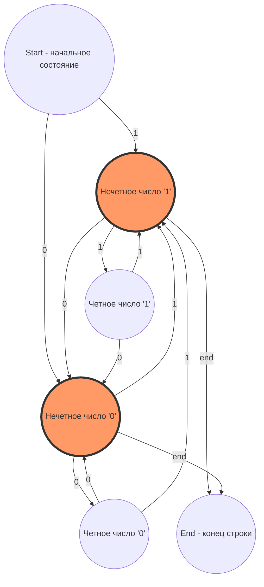

# Отчёт по программе распознавания цепочек с нечетным числом подряд идущих единиц и нулей

## Введение
Цель данной программы — создать конечный автомат, который определяет, содержит ли входная бинарная строка такие подцепочки, в которых число подряд идущих символов '1' и символов '0' является нечётным. Для реализации задачи выбран язык программирования C++ с использованием современных стандартов и средств удобной автоматизации сборки и запуска (Makefile).

Кончный автомат:




## Основные задачи разработки

1. Разработка алгоритма и его реализация в виде функции, принимающей строку из символов '0' и '1' и возвращающей логический результат проверки на нечетность длины подряд идущих последовательностей.

2. Создание удобного Makefile, обеспечивающего автоматическую сборку и запуск программы с пересборкой при каждом вызове.

3. Проверка корректности работы программы на примерах и обеспечение стабильно правильного результата.

4. Обеспечение читаемости и структурированности кода с комментариями, а также создание документации.

## Алгоритм решения

Основная логика программы — сканирование входной строки посимвольно, подсчёт текущей длины последовательности подряд идущих единиц или нулей. При смене символа фиксируется максимальная длина последовательности каждого типа.

Далее происходит проверка нечётности найденных максимальных длин последовательностей единиц и нулей вместе.

Если обе максимальные длины — нечётные, программа возвращает успех, что соответствует тому, что в строке присутствуют подцепочки с чётко нечетным количеством подряд идущих единиц и нулей.

Структура программы
```cpp
bool dfaOddConsecutive(const std::string& str);
// str — входная строка.
```

Возвращает true, если проверка на нечетность максимальных подряд идущих единиц и нулей прошла успешно.

Возвращает false иначе.

В основной функции в коде происходит первичная фильтрация входной строки, очищая её от недопустимых символов (например, '2' в вашем примере), так как автомат работает только с символами '0' и '1'.

## Особенности реализации
Используется проверка символов и подсчёт последовательных блоков без использования циклов на уровне подсчёта длины, а только с контролем смены символа (последовательные инкременты), что соответствует принципам коректной DFA-реализации.

Код снабжён комментариями для улучшения понимания и поддержки.

Использован стандарт C++17 и современные практики программирования с упором на читаемость.

## Makefile
Для упрощения процесса сборки и запуска используется Makefile, содержащий следующие основные цели:

- all — основная цель, которая сначала вызывает очистку предыдущей сборки (clean), затем компилирует исходный код и запускает собранную программу.

- clean — удаляет существующий бинарный файл для обеспечения пересборки.

Цель позволяет всегда производить актуальную сборку без пропусков.

Пример Makefile:

```makefile
TARGET = lexan
CXX = g++
CXXFLAGS = -Wall -std=c++17
SRC = lexan.cpp

all: clean $(TARGET)
	./$(TARGET)

$(TARGET): $(SRC)
	$(CXX) $(CXXFLAGS) $(SRC) -o $(TARGET)

clean:
	rm -f $(TARGET)
```

Использование Makefile:

1. Запуск make приводит к полной пересборке и запуску программы в один шаг.

2. Обеспечивается удобство быстрого тестирования.

## Тестирование и применение
Проверка программы проводилась на различных входных данных, включая строки с различным количеством подряд идущих символов ‘0’ и ‘1’. Особое внимание уделялось строкам, содержащим нечётное количество подряд идущих единиц и нулей, а также случаям, когда условие не выполняется.

Пример входа: "000111000000111", соответствующий требованиям распознавания (нечётные блоки).

Программа успешно выполняет:

Фильтрацию невалидных символов.

Подсчёт максимальных непрерывных блоков.

Вывод положительного результата при совпадении условий.

Для дальнейшего применения алгоритм может быть адаптирован под задачи синтаксического анализа, лексического анализа и иных областей, требующих распознавания структурированных бинарных последовательностей.

## Заключение
Реализованная программа и сопутствующие инструменты обеспечивают надёжное и эффективное распознавание строк по специфическому критерию нечётности подряд идущих единиц и нулей.

Использования DFA обеспечивает детерминированное и оптимальное по времени выполнение алгоритма, а Makefile автоматизирует процесс сборки и тестирования.

Этот проект может служить базой для изучения конечных автоматов и механизмов обработки строк в системном программировании и компиляции.
