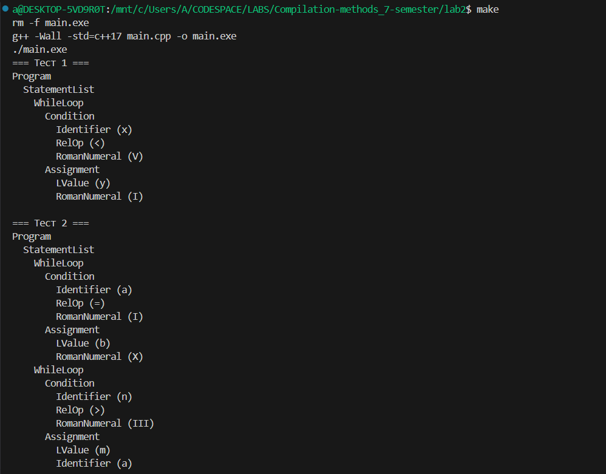

# Отчёт по программе синтаксического анализа операторов цикла `while (...) ... done`

## Введение

Цель данной программы — разработать лексический и синтаксический анализаторы для языка, содержащего операторы цикла вида `while (...) ... done`, разделённые символом `;`. Программа должна принимать текст на этом языке, выполнять лексический анализ (разбиение на токены), синтаксический анализ (проверку структуры) и строить дерево разбора (AST). Для реализации выбран язык программирования C++ с использованием современных стандартов и средств автоматизации сборки (Makefile).

Дерево разбора (AST):

```
Program
  StatementList
    WhileLoop
      Condition
        Identifier (x)
        RelOp (<)
        RomanNumeral (V)
      Assignment
        LValue (y)
        RomanNumeral (I)
```

## Основные задачи разработки

1. **Разработка лексического анализатора**, распознающего ключевые слова (`while`, `done`), идентификаторы, римские числа (записанные заглавными `I`, `V`, `X`), операторы сравнения (`<`, `>`, `=`), присваивания (`:=`) и разделителя (`;`).

## Таблица LR-анализа

| State | while | done | (   | )   | ;   | IDENTIFIER | ROMAN_NUMERAL | :=  | <   | >   | =   | $   | Program | StatementList | Statement | Condition | Body | Assignment | Expression | RelOp |
|-------|-------|------|-----|-----|-----|------------|---------------|-----|-----|-----|-----|-----|---------|--------------|-----------|-----------|------|------------|------------|-------|
| 0     | s2    |      |     |     |     | s3         |               |     |     |     |     |     | g1      |              |           |           |      |            |            |       |
| 1     |       |      |     |     |     |            |               |     |     |     |     | acc   |          |              |           |           |      |            |            |       |
| 2     |       |      | s4  |     |     |            |               |     |     |     |     |     |         |              |           |           |      |            |            |       |
| 3     |       |      |     |     |     |            |               | s5  |     |     |     |     |         |              |           |           |      |            |            |       |
| 4     |       |      |     |     |     | s8         | s9            |     |     |     |     |     |         |              |           | g6        |      |            | g7         |       |
| 5     |       |      |     |     |     | s8         | s9            |     |     |     |     |     |         |              |           |           |      |            | g10        |       |
| 6     |       |      |     |     |     |            |               |     | s11 | s12 | s13 |     |         |              |           |           |      |            |            |       |
| 7     |       |      |     |     |     |            |               |     |     |     |     |     |         |              |           |           |      |            |            |       |
| 8     |       |      |     |     |     |            |               |     |     |     |     | r8   |         |              |           |           |      |            |            |       |
| 9     |       |      |     |     |     |            |               |     |     |     |     | r9   |         |              |           |           |      |            |            |       |
| 10   |       |      |     | r7  |     |            |               |     |     |     |     |     |         |              |           |           |      |            |            |       |
| 11   |       |      |     |     |     |            |               |     |     |     |     | r10  |         |              |           |           |      |            |            |       |
| 12   |       |      |     |     |     |            |               |     |     |     |     | r11  |         |              |           |           |      |            |            |       |
| 13   |       |      |     |     |     |            |               |     |     |     |     | r12  |         |              |           |           |      |            |            |       |
| 14   |       |      |     | s15 |     |            |               |     |     |     |     |     |         |              |           |           |      |            |            |       |
| 15   |       |      |     |     |     | s17        |               |     |     |     |     |     |         |              |           |           | g16  |            |            |       |
| 16   |       | s18  |     |     |     |            |               |     |     |     |     |     |         |              |           |           |      |            |            |       |
| 17   |       |      |     |     |     |            |               | s19 |     |     |     |     |         |              |           |           |      |            |            |       |
| 18   | r4    |      |     |     | s20 |            |               |     |     |     |     | r4   |         |              |           |           |      |            |            |       |
| 19   |       |      |     |     |     | s8         | s9            |     |     |     |     |     |         |              |           |           |      |            | g21        |       |
| 20   | s2    |      |     |     |     | s3         |               |     |     |     |     |     |         | g22          |           |           |      |            |            |       |
| 21   |       |      |     |     |     |            |               |     |     |     |     | r6   |         |              |           |           |      |            |            |       |
| 22   |       |      |     |     |     |            |               |     |     |     |     | r3   |         |              |           |           |      |            |            |       |

## Обозначения в заголовках таблицы

### Терминалы (токены)
| Токен | Описание |
|-------|----------|
| `while`, `done` | Ключевые слова языка |
| `(`, `)`, `;` | Символы-разделители |
| `IDENTIFIER` | Идентификаторы (имена переменных) |
| `ROMAN_NUMERAL` | Римские числа (I, V, X) |
| `:=` | Оператор присваивания |
| `<`, `>`, `=` | Операторы сравнения |

### Нетерминалы (правила грамматики)
| Нетерминал | Описание |
|------------|----------|
| `Program` | Корневое правило программы |
| `StatementList` | Список операторов |
| `Statement` | Одиночный оператор |
| `Condition` | Условие цикла |
| `Body` | Тело цикла |
| `Assignment` | Оператор присваивания |
| `Expression` | Выражение |
| `RelOp` | Оператор отношения |

## Цифровые обозначения

### В действиях (sN, rN, gN)
| Обозначение | Значение |
|-------------|----------|
| **N** в **sN** | Номер состояния для перехода |
| **N** в **rN** | Номер правила грамматики для свёртки |
| **N** в **gN** | Номер состояния для перехода после свёртки |

### Состояния автомата
| Диапазон | Назначение |
|----------|------------|
| 0 | Начальное состояние |
| 1-22 | Внутренние состояния LR-автомата |

## Специальные случаи

| Обозначение | Ситуация | Реакция |
|-------------|----------|---------|
| **Пустая ячейка** | Ошибка синтаксиса | Анализатор останавливается с сообщением об ошибке |
| **rN в столбце $** | Успешный разбор | Возможность завершения анализа |
| **acc в столбце $** | Полное принятие | Строка полностью соответствует грамматике |

## Алгоритмы вычисления

### Вычисление FIRST(X)
```
Если X - терминал:
    FIRST(X) = {X}
    
Если X - нетерминал:
    Для каждого правила X → Y₁Y₂...Yₙ:
        Добавить FIRST(Y₁) в FIRST(X)
        Если ε ∈ FIRST(Y₁), добавить FIRST(Y₂)
        Если ε ∈ FIRST(Y₂), добавить FIRST(Y₃)

Если X → ε:
    Добавить ε в FIRST(X)
```

### Вычисление FOLLOW(A)

```
1. Добавить $ в FOLLOW(S)

2. Для каждого правила B → αAβ:
    - Добавить FIRST(β) - {ε} в FOLLOW(A)
    - Если ε ∈ FIRST(β), добавить FOLLOW(B) в FOLLOW(A)

3. Для каждого правила B → αA:
    - Добавить FOLLOW(B) в FOLLOW(A)
```

2. **Реализация синтаксического анализатора** на основе грамматики:
```
Program      → StatementList
StatementList→ Statement (';' Statement)*
Statement    → while '(' Condition ')' Body done
Condition    → Expression RelOp Expression
Body         → Assignment
Assignment   → IDENTIFIER ':=' Expression
Expression   → IDENTIFIER | ROMAN_NUMERAL
RelOp        → '<' | '>' | '='
```

3. **Построение и вывод дерева абстрактного синтаксиса (AST)** для визуальной проверки корректности разбора.

4. **Создание Makefile**, обеспечивающего автоматическую сборку и запуск программы с пересборкой при каждом вызове.

## Алгоритм решения

Программа выполняет два основных этапа:

- **Лексический анализ**: входная строка сканируется посимвольно. Распознаются ключевые слова, символы и лексемы. Слова из букв `I`, `V`, `X` интерпретируются как римские числа, остальные — как идентификаторы.
  
- **Синтаксический анализ**: на основе потока токенов рекурсивным спуском строится AST. Каждый узел дерева соответствует конструкции языка (цикл, условие, присваивание и т.д.).


Функция `tokenize` возвращает вектор токенов. Класс `Parser` строит AST. Функция `printAST` выводит дерево с отступами.


## Makefile

Для упрощения сборки и запуска используется следующий Makefile:

```makefile
TARGET = main.exe
CXX = g++
CXXFLAGS = -Wall -std=c++17
SRC = main.cpp

all: clean $(TARGET)
	./$(TARGET)

$(TARGET): $(SRC)
	$(CXX) $(CXXFLAGS) $(SRC) -o $(TARGET)

clean:
	rm -f $(TARGET)
```

Использование:
1. Команда `make` выполняет полную пересборку и запускает программу.
2. Цель `clean` удаляет старый исполняемый файл, гарантируя актуальную сборку.

Это обеспечивает удобство тестирования и отладки.

## Тестирование и применение

Программа протестирована на следующих входных данных:

```text
while (x < V) y := I done
while (a = I) b := X done; while (n > III) m := a done
```
Вывод программы:


Также проверена реакция на ошибки (пропущенное `done`, неверный оператор и т.д.) — программа корректно завершается с диагностикой.


## Заключение

Реализованная программа успешно решает задачу синтаксического анализа заданного языка. Архитектура «лексер → парсер → AST» соответствует классическим принципам построения компиляторов и может быть расширена для поддержки более сложных конструкций (блоков, выражений, семантического анализа). Использование Makefile автоматизирует процесс сборки и тестирования, а читаемый код с документацией обеспечивает поддерживаемость. Проект демонстрирует понимание основ лексического и синтаксического анализа и может служить основой для дальнейшего изучения теории компиляторов.
